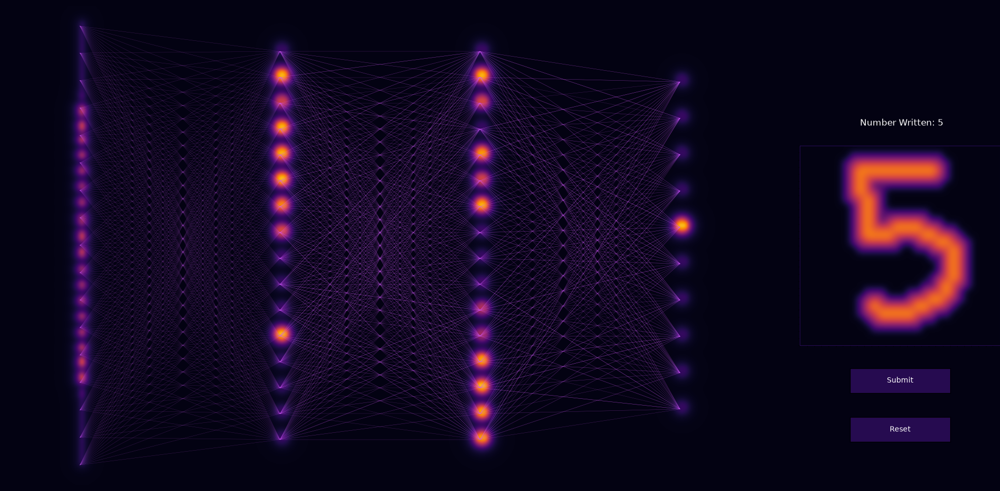

# MNIST Neural Network + Forward Propagation Visualizer

This documentation describes my MNIST Neural Network + Forward Propagation Visualizer project. This project is part 1/4 of my NIPU project. This is a classic number recognizer neural network using the MNIST dataset. Additionally I created a cool visualizer for the forward propagation and the ability to write hand written digits for testing the neural network. 

## Table of Contents
- [Overview](#overview)
- [Forward Propagation](#forward-propagation)
- [Backpropagation](#backpropagation)
- [Visualizer](#visualizer)

## Overview
This neural network (NN) is build around the MNIST dataset for digit classification. Additionally, the math behind this NN is heavily based on 3b1b's course on Neural Networks and Deep Learning.

For any NN of this data set, we must have 784 input neurons, corresponding to the grid of 28x28 pixels in each handwritten digit. Additionally, this NN classifies digits as integers in the (0, 9) range, meaning we must have exactly 10 output neurons. Decisions around hidden layers are much more flexible. I implemented two hidden layers each with 16 neurons mainly for visualization reasons (which just so happens to match 3b1b's course). 

In general the choice for dimensions regarding the hidden layers was mostly irrelevant, as I am not so concerned about NN performance and accuracy, as this is mainly just to provide a visualization for my NIPU project.

## Forward Propagation
Forward propagation is the most trivial part of the NN. In simple terms, forward propagation is the act of a NN performing its intended operation. In a way you can simply think of a NN as a very complex function. Something that take in an input, and spits out some output based on that input.

We know that the activations in any hidden or output layer are dependent on the activations, weights, and biases of the previous layer. Additionally you can use a sigmoid or ReLU to force your activations into a given range. I opted for the sigmoid for simplicity, however this decision is mostly unimportant for reasons stated above. 

An activation is defined as a linear combination of all activations in the previous layer and their respective weights, then adding a bias. Therefore the forward propagation equation is:

$a_L = \sigma(W_{L} * a_{L-1} + b_L), \quad where, \quad \sigma(x) = \frac{1}{1 + e^{-x}}$

Where $a_L$ are the activations of your current layer, $a_{L-1}$ are the activations of your previous layer, $W_L$ are the corresponding weights, and $b_L$ are the corresponding biases.

## Backpropagation
Backpropagation is the process of adjusting values to set those weights and biases to such that the NN can actually recognize digits. In simple terms, this means tuning the NN's properties or training the NN to do what you want.

In general backpropagation requires relatively good knowledge of multivariable calculus and processes like gradient descent, so if anything is unclear, please refer to 3b1b's course on NNs. 

This code uses stochastic gradient descent in addition to a very basic backpropagation algorithm. 

## Visualizer
Running the python script `main.py` will start up the finalized visualizer. On the right there is a panel where you can draw hand written digits and test the NN's ability. In general the accuracy for custom hand written digits is far lower than the training data suggests as many handwritten digits from humans do not match many characteristics from the MNIST dataset (e.g. digits not being centered, not touching edges, etc.).
